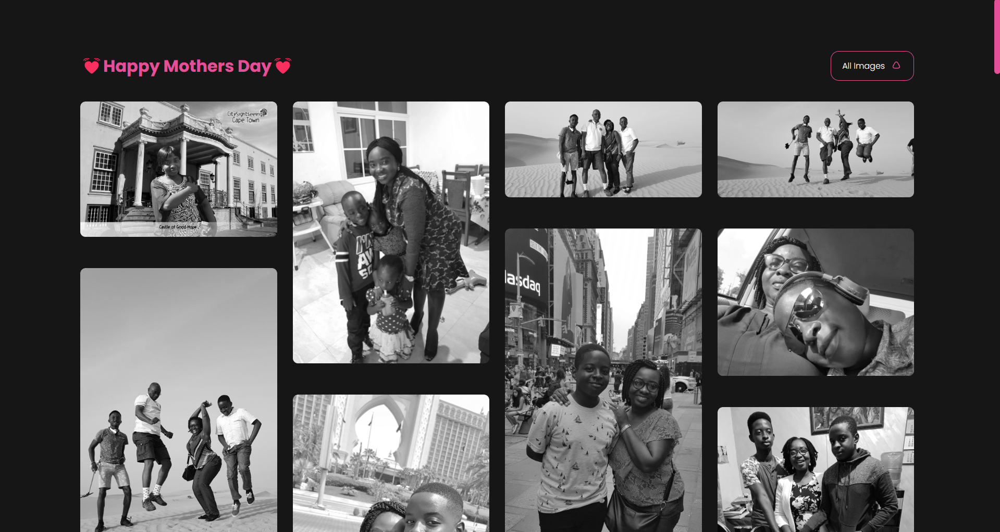

<h1 align="center">Threads Of Time</h1>
I'm just making this fun project as a mothers day gift for my mom. I hope you like it too. 🎁🎉

<h2 align="center">Preview</h2>

I deploy this Gallery on [Netlify](https://treadsoftime.netlify.app/) or see the below preview 😉🖼

# 📍 Installation steps ⚙
    clon this repo with this command: git clone https://github.com/Llewellyn500/threads-of-time.git
    go to the directory and enter: npm i
    when all packages are completely installed enter: npm start